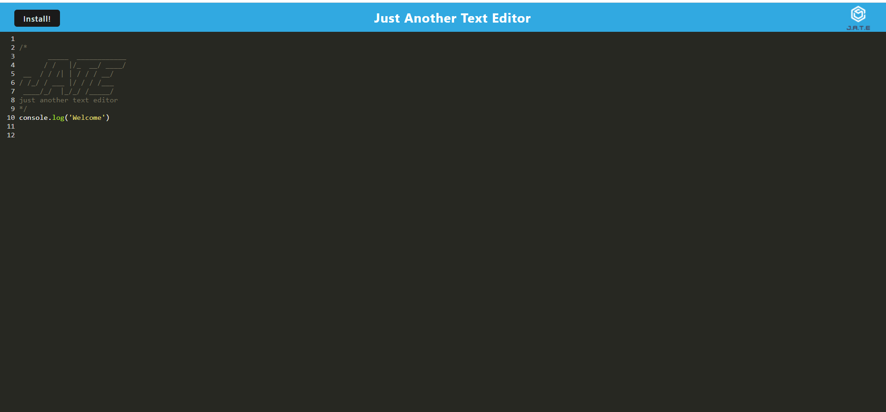
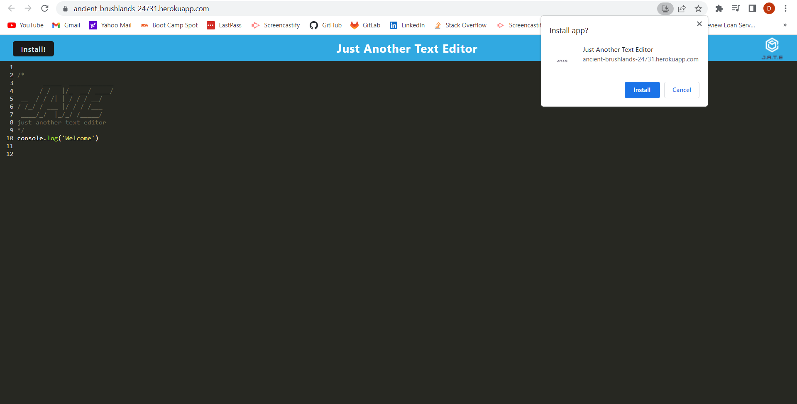
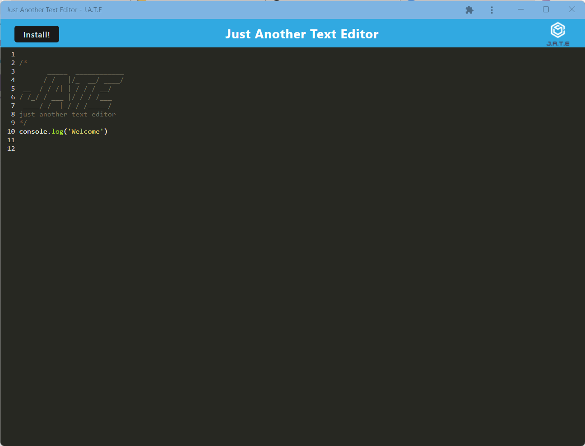
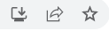

## Description

**Text Editor** is a single-page application where users are able to type their thoughts, to-do list, or random facts in a browser online or offline. 

    
  </a>

  ## Table of contents
  - [Top](#)
  - [Description](#Description)
  - [Create Your Edits](#CreateYourEdits)
  - [Technologies](#Technologies)

## Create Your Edits

Customize your text editor by downloading the app today! 

* Click the [Link](https://ancient-brushlands-24731.herokuapp.com/) to access the Text Editor App
* Navigate to the top right of your browser and click `Install`

    
  </a>

* After installation, your application will appear just like below!

    
  </a>

Please Note, you can also download the application by locating the below further icon in your url text area.

    
  </a>

## Technologies

Text Editor was built using the following technologies:

  
      
      
      
      
      

